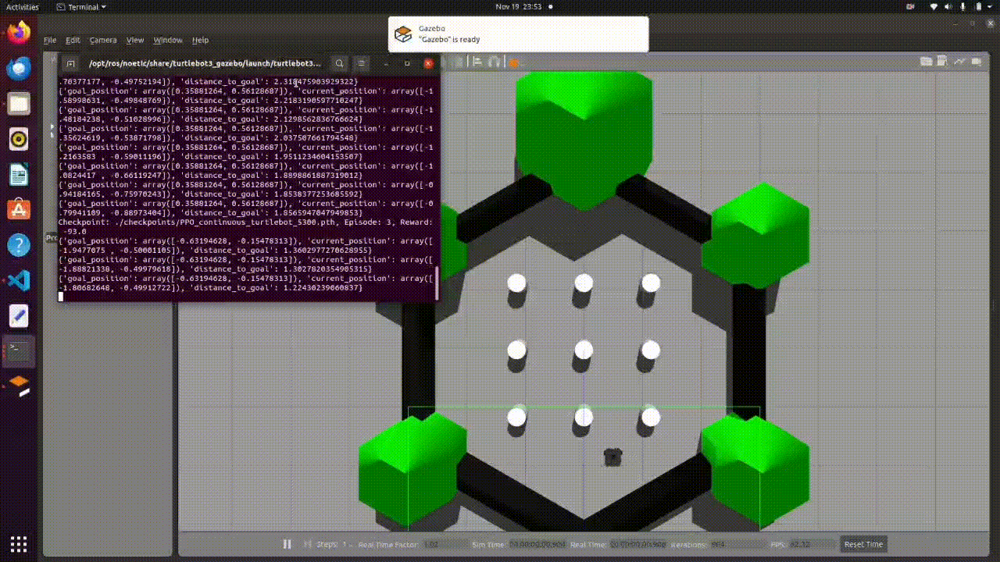

# RL-Based Autonomous Navigation with TurtleBot3

This project demonstrates a reinforcement learning (RL) approach for autonomous navigation of TurtleBot3 in a simulated environment using the Proximal Policy Optimization (PPO) algorithm. The goal of the agent is to reach a specific target while navigating through the environment. The state and goal positions are fed as inputs to the PPO agent, enabling precise navigation.

## Features
- **Goal-Reaching Task**: The agent is trained to navigate towards a goal, with the goal position refreshing after every episode.
- **Goal and State Input**: The model uses both the current position (state) and the goal position as inputs to the PPO agent.
- **Simulated Environment**: The simulation uses the [TurtleBot3 Gazebo](https://github.com/ROBOTIS-GIT/turtlebot3) environment with ROS Noetic.


## Getting Started

### Prerequisites
Make sure you have the following installed:
- ROS Noetic
- TurtleBot3
- Gym
- Stable-Baselines3
- PyTorch

### Setup
#### 1. Clone the repository:
```
git clone https://github.com/SumukhShrote/RL_Turtlebot.git
cd RL_Turtlebot
```

#### 2. Add all files to the src folder of your workspace

Navigate to your ROS workspace and build it using catkin_make
```
cd ~/catkin_ws
catkin_make
source devel/setup.bash
```

#### 3.Training the Agent

To train the PPO agent, run the following script:
```
python3 src/train_ppo.py
```

The goal position for each episode is refreshed once the agent either collides with an obstacle or reaches the goal. The environment will reset with a new goal for each episode.


#### 4.Testing the Trained Model

Once training is complete, you can test a specific checkpoint by running:
```
python3 src/checkpoint_test.py 
```

Change the location of check in the following line (line 52) of the checkpoint_test.py:
```
checkpoint_path='./checkpoints/PPO_continuous_turtlebot_5300.pth'
```
This script will load the model checkpoint and evaluate the agent's performance on the goal-reaching task.

### Demo



